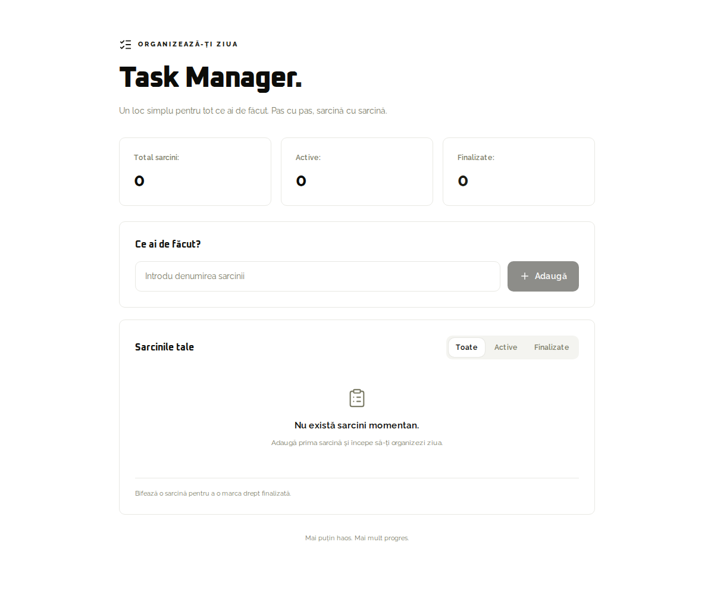
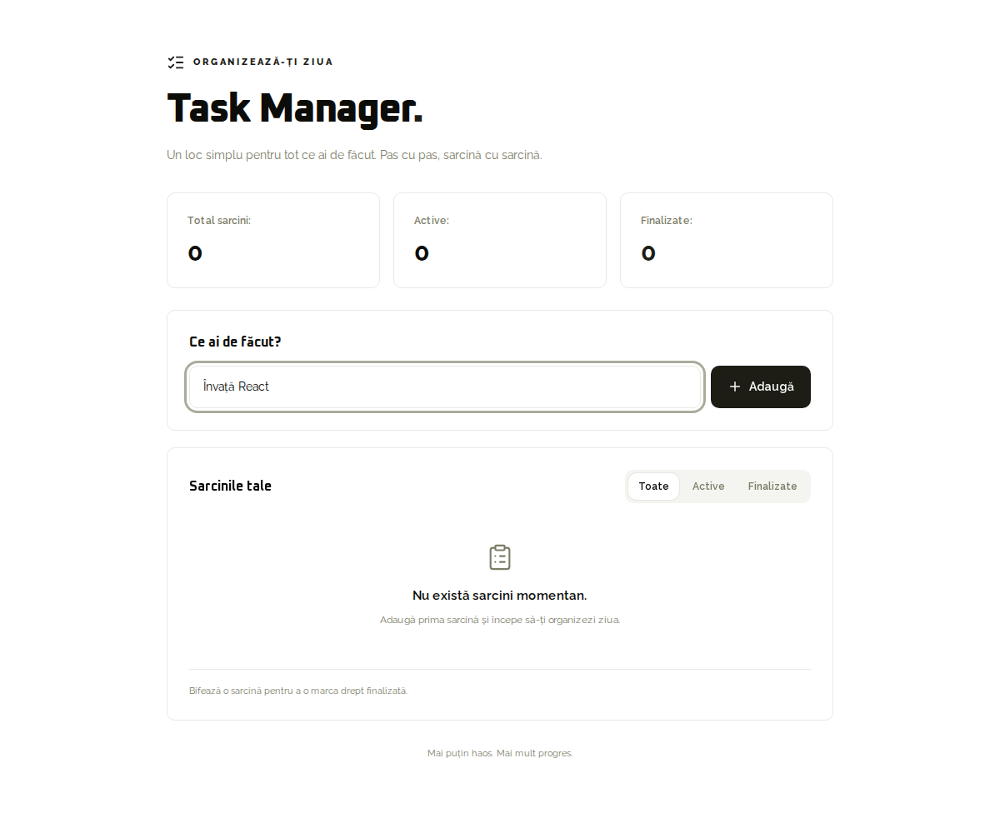
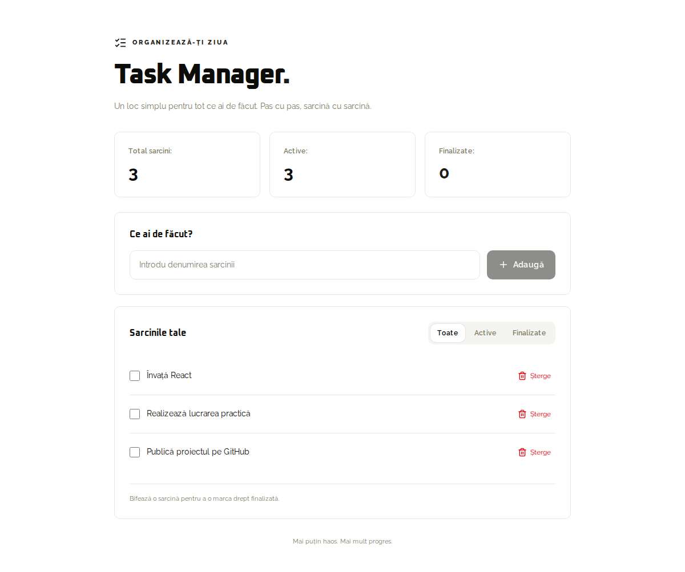
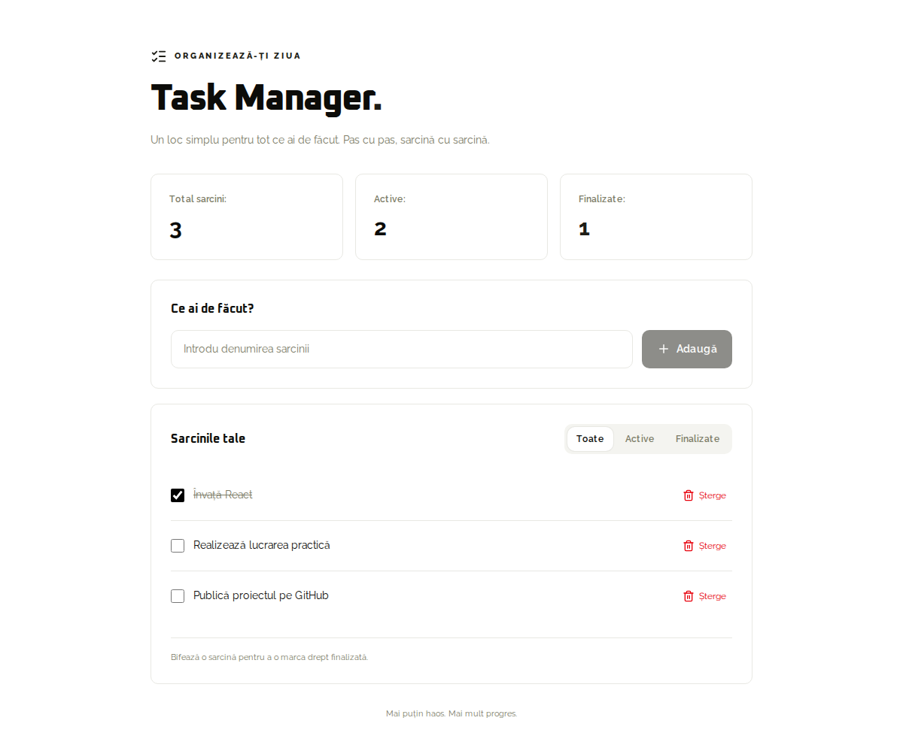
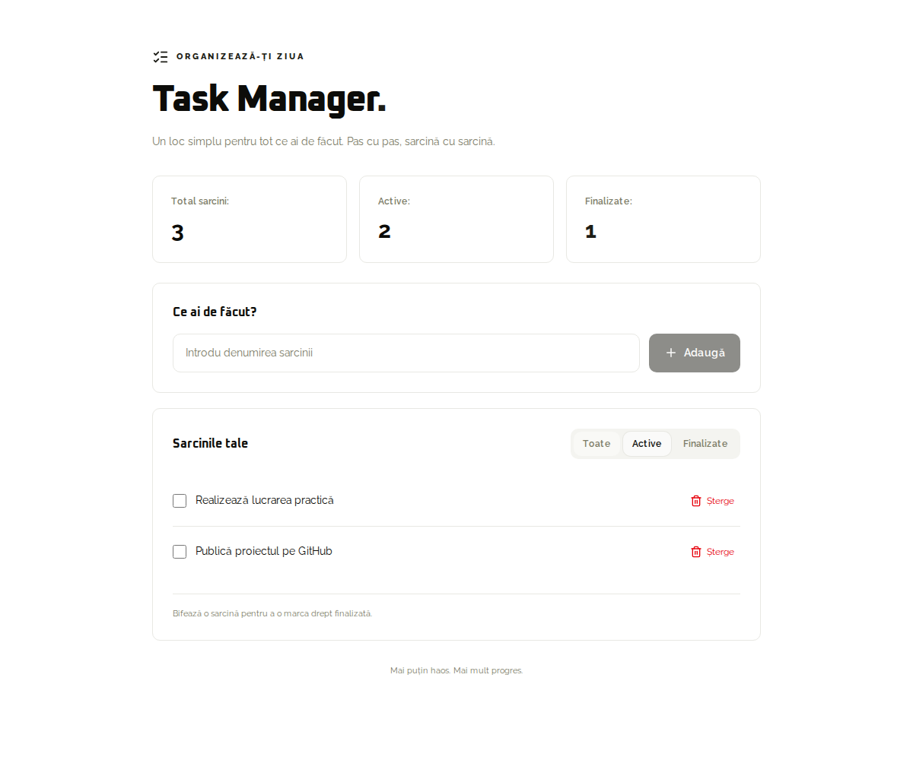
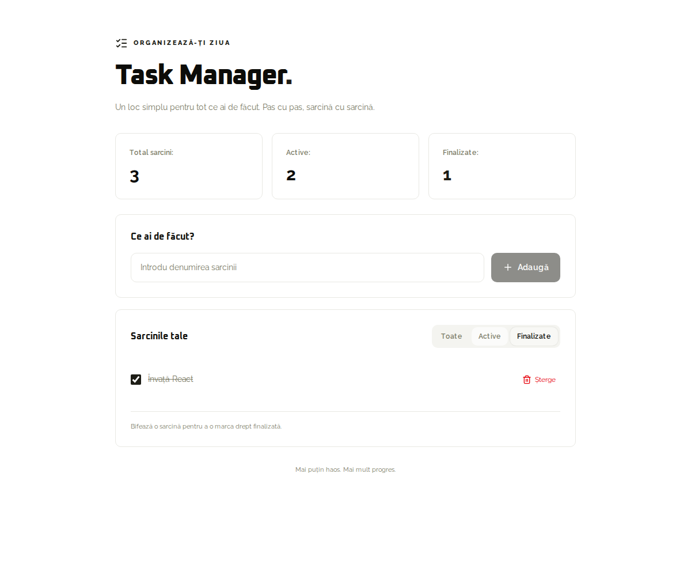
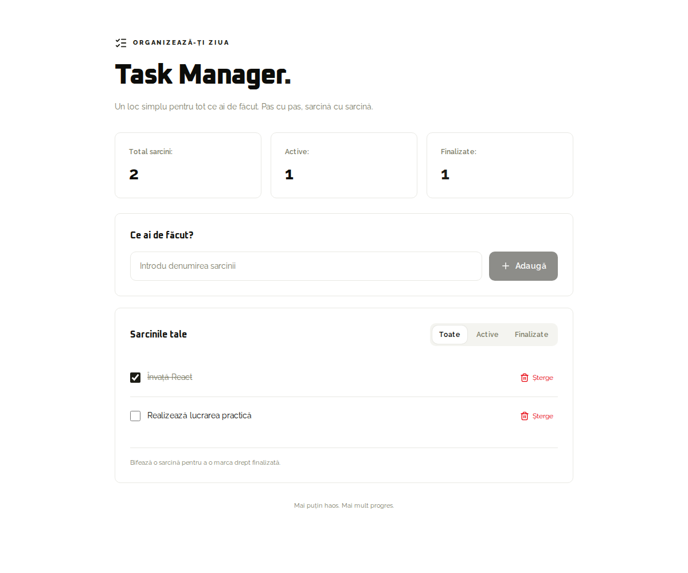
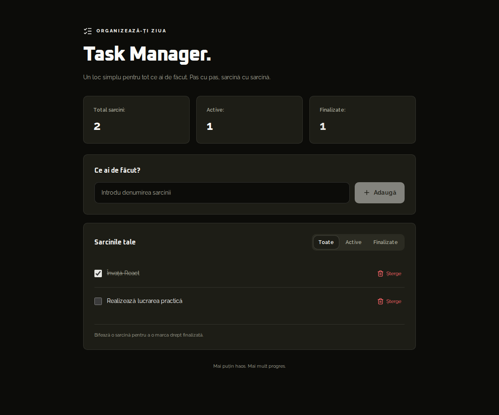
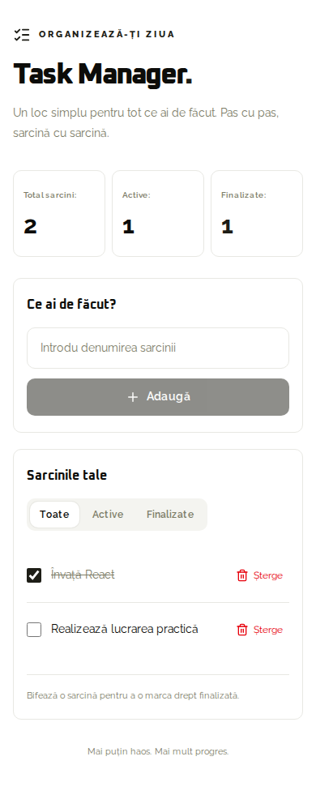

# Task Manager

Aplicație pentru gestionarea sarcinilor, realizată cu **Next.js, React și TypeScript (TSX)**. Interfața folosește tema și fonturile din `app/globals.css`.

## Pornire

Ai nevoie de Bun.

```bash
bun install
bun run dev
```

Deschide adresa afișată în terminal, implicit `http://localhost:3000`.

## Utilizare

1. Introdu denumirea și apasă **Adaugă** sau **Enter**.
2. Bifează o sarcină pentru a o finaliza; debifeaz-o pentru a o reactiva.
3. Apasă **Șterge** pentru a elimina o sarcină.
4. Folosește filtrele **Toate**, **Active** și **Finalizate**.

Inputul gol sau format doar din spații nu este acceptat. Contoarele afișează totalul, sarcinile active și cele finalizate. Lista goală are un mesaj dedicat.

Sarcinile sunt păstrate în starea React și se resetează la reîncărcarea paginii. Tema urmează setarea sistemului; tasta **D** schimbă tema când nu scrii într-un câmp.

## Structura proiectului

| Fișier / folder | Rol |
| --- | --- |
| `app/page.tsx` | Lista de sarcini, contoarele și filtrele. |
| `components/TaskForm.tsx` | Formularul și valoarea inputului, gestionată cu `useState`. |
| `components/Task.tsx` | O sarcină, primită prin props, cu checkbox și ștergere. |
| `components/task-manager.module.css` | Aranjarea responsive și stilurile care folosesc variabilele globale. |
| `app/globals.css` | Culorile, fonturile și tema globală. |

## Răspunsuri pentru lucrarea practică

1. **Rolul `src`:** conține codul aplicației în exemplul Vite. Aici codul este organizat în `app/`, `components/` și `lib/`.
2. **Rolul `App.jsx`:** componenta principală din exemplul React/Vite. În acest proiect, pagina principală este `app/page.tsx`.
3. **Rolul `package.json`:** păstrează informațiile proiectului, dependențele și scripturile proiectului, executate cu Bun.
4. **Rolul `node_modules`:** conține pachetele instalate și dependențele lor.

## Verificare

```bash
bun run typecheck
bun run lint
bun run build
```

Fluxul interactiv a fost verificat cu Playwright în Chromium: validare, adăugare, bifare/debifare, filtre, ștergere, tema întunecată și afișarea pe mobil.

## Capturi de ecran

Fiecare imagine prezintă o funcționalitate sau un mod de afișare al aplicației.

### 1. Pagina inițială — fără sarcini

> **Ce arată imaginea:** Aplicația pornește cu lista goală, contoarele la zero și mesajul „Nu există sarcini momentan.”



### 2. Formularul — introducerea unei sarcini

> **Ce arată imaginea:** Câmpul conține „Învață React”, iar butonul „Adaugă” permite trimiterea sarcinii.



### 3. Lista — sarcini adăugate

> **Ce arată imaginea:** Cele trei sarcini apar în listă, fiecare cu un checkbox și un buton „Șterge”. Contoarele indică trei sarcini active.



### 4. Finalizarea — bifarea unei sarcini

> **Ce arată imaginea:** „Învață React” este bifată și tăiată. Contoarele indică două sarcini active și una finalizată.



### 5. Filtrul Active — sarcini de făcut

> **Ce arată imaginea:** Lista afișează doar cele două sarcini nefinalizate. Sarcina bifată este ascunsă.



### 6. Filtrul Finalizate — sarcini încheiate

> **Ce arată imaginea:** Lista afișează doar sarcina „Învață React”, marcată ca finalizată.



### 7. Ștergerea — eliminarea unei sarcini

> **Ce arată imaginea:** Sarcina „Publică proiectul pe GitHub” a fost eliminată. Au rămas două sarcini, dintre care una finalizată.



### 8. Tema întunecată — aspectul dark

> **Ce arată imaginea:** Aceeași listă este afișată pe fundal întunecat, cu text deschis și culorile din tema globală.



### 9. Versiunea mobilă — ecran îngust

> **Ce arată imaginea:** Formularul este aranjat vertical, iar filtrele și lista se adaptează la lățimea unui telefon.


